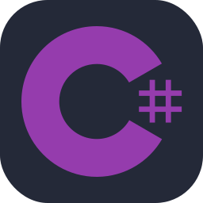

# RoboRush
This game was made for the [CVRI Indie Game Jam W25](https://gamejam.ca) hosted by Conestoga College. The game is a simple time-based management game in which the player is in charge of a factory powered by robots. Occasionally, the robots can break down, and the player must repair them by playing a short minigame. Each day in the factory is randomized, with the overall difficulty increasing each day they progress. Players are able to track their high score and view it within the factory's breakroom. The game features procedurally generated music, keeping each day unique and exciting.

[Play the game on itch.io!](https://th3-hero.itch.io/roborush)

## Techonology

    
    
    
    
    

[Icon Source](https://github.com/tandpfun/skill-icons)

## Contributors
-  [Brooke Cronin](https://github.com/brookec123) - Level Generation
-  [Colin Greenidge](https://github.com/ColinGreenidge8896) - Programming and Project Management
-  [Connor Miller](https://github.com/millerforce) - Programming and Game Design
-  [Dylan Glass](https://github.com/glaslan) - Music and SFX
-  [Ethan Waddell](https://github.com/ethaanwaddell) - Modeling and Art
-  [Lexie Haveman](https://github.com/leh-x) - Art and Game Design
-  [William Paetz](https://github.com/Th3-Hero) - Programming and Modeling

### Hints
-  The notes for Happy Manufacturing Date are CCDCFE
-  Passwords for reseting the robots are given within the hint
